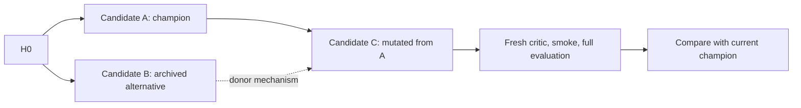

# RRSI Product Review and Improvement Implementation Plans

> **For agentic workers:** Use `superpowers:executing-plans` or `superpowers:subagent-driven-development` when implementation is requested. Unchecked steps below describe future work; this review does not implement them.

**Goal:** Make RRSI easier to start, safer to operate, and more trustworthy as an agent-harness experimentation tool.

**Architecture:** Preserve the Python CLI, domain adapters, Git-backed candidates, and regularized selection method as the default. Strengthen configuration, state, and evidence first; then add explicit experiment graphs and opt-in evolution strategies that can be compared against that default.

**Tech stack:** Python, Git worktrees, JSON/JSONL artifacts, shell runners, Docker, MCP gateways, and domain-specific benchmark environments.

**Spec and scope:** The product assessment and acceptance criteria in this document are the proposed specification. This is a repository-based review at commit `be50316e1db05914068a973f322770ef08ed7ba1`, dated 29 September 2026, extended with evolution-loop and graph-strategy recommendations. Estimates and success targets are planning proposals, not measured outcomes.

## Product assessment

RRSI is currently a research CLI for improving an existing agent harness against a benchmark. Its most plausible primary users are researchers reproducing experiments and engineers adapting the search loop to their own agents. This audience assessment is inferred from the README and interfaces; no user interviews or usage analytics were available.

The core value is clear: generate constrained harness changes, screen them for benchmark leakage, measure score and token use, and retain improvements with an auditable history. The domain boundary and Git-backed candidates are useful foundations. The next product milestone should be **a reproducible experiment that a new user can start, interrupt, resume, and explain without manually repairing state**.

### Strengths to preserve

- **A coherent method-to-code mapping.** The [README](../README.md) explains how proposal budgets, history, critic screening, noise bands, cost rules, and pruning fit together.
- **Separation of search and benchmark execution.** The [Domain interface](../rrsi/domain.py#L55) keeps benchmark-specific runners and grading outside the core loop.
- **Reviewable candidate artifacts.** Proposals, diffs, smoke results, decisions, evaluations, and history provide the ingredients for useful experiment reports.
- **Existing method tests.** [Eight offline tests](../tests/test_core.py#L56) exercise scheduling, aggregation, calibration, selection, history, component normalization, and configuration loading.
- **Domain-specific quality protection.** Engineering guards and separate held-out/OOD workflows support evaluation beyond headline evolve-set gains.

### Where the user journey breaks down

| Stage | Current experience | Improvement opportunity |
|---|---|---|
| Understand | Strong research explanation and result tables | Add a short operator journey, environment matrix, and an offline example |
| Configure | Multiple interpreters, environment variables, external checkouts, and gateway conventions | Resolve configuration once and validate prerequisites before inference |
| Start | Smoke and baseline depend on substantial infrastructure | Provide a free diagnostic command and an explicit workload preview |
| Run/resume | JSON artifacts and worktrees support partial reuse, but recovery has unsafe boundaries | Make settlement transactional and retries respect round dependencies |
| Judge results | Score and cost decisions are available, but provenance and measurement completeness are not enforced centrally | Bind every measurement to its inputs and expose uncertainty/missing evidence |
| Operate | Cleanup and OOD export scripts manipulate shared resources | Track ownership and make external mutations recoverable |
| Extend | Adapters offer a useful interface with few automated conformance checks | Supply a toy adapter, contract tests, and a contributor path |

## Review evidence and limitations

Reviewed the main README, domain setup guides, CLI, core search/state/evaluation modules, adapters, selected runner/gateway/OOD scripts, dependency metadata, and existing tests. No cloud model calls, benchmark evaluations, Docker workloads, or external-checkout modifications were performed. Reported paper results were not independently reproduced, and the paper/project website was not audited.

The graph-strategy extension also consulted the primary-source abstracts for Darwin Gödel Machine, GEPA, AFlow, and Graph of Thoughts, linked below. These establish relevant design precedents; they do not validate the proposed changes on RRSI. The test results below belong to the original review; this documentation extension adds no runtime implementation.

Verification performed:

- The default `python3` is Python 3.8, below the repository's declared Python 3.10 minimum. Both the default interpreter and the installed Python 3.11 interpreter lack `pytest`; `python -m pytest` could not run. This is a local environment limitation, not a failing project test.
- Running `tests/test_core.py` with the installed Python 3.11.14 interpreter completed successfully: **8/8 tests passed**. Reproduction command: `/Users/johnwei77/.local/share/uv/python/cpython-3.11-macos-aarch64-none/bin/python3.11 tests/test_core.py`.
- Offline probes reproduced the missing-project `ZeroDivisionError`, acceptance of invalid configuration values, and aggregation of one supplied success at `k=2` as `S=1.0`, `n_expected=2`, `missing=0`.
- Isolated review probes also reproduced failed-round advancement and false completion, admissibility with unknown candidate token cost, and cross-domain module reuse when loading multiple adapters in one process.
- Crash windows, stale-cache risks, gateway mismatches, and cleanup/export behavior were traced in source. They were not tested against live benchmark infrastructure.

## Priorities and delivery order

P0 means a prerequisite for trusting unattended experiments; P1 addresses first-use and operational reliability; P2 improves planning, interpretation, and extension. Effort estimates are engineering days for one contributor familiar with the repository, including tests and documentation but excluding benchmark runtime and external access delays.

| Plan | Priority | Deliverable | Estimate | Dependencies |
|---|---|---|---|---|
| 1 | P0 | Recoverable run state and correct round progression | 6–9 days | None; use a small fake domain for tests |
| 2 | P0 | Evaluation provenance and measurement validity | 6–9 days | Coordinate persistence with Plan 1 |
| 3 | P1 | Consistent configuration and first-run diagnostics | 4–6 days | None |
| 4 | P2 | Workload preview and operational spending controls | 4–6 days | Plans 1–3 |
| 5 | P2 | Explainable experiment and transfer reports | 3–5 days | Plans 1–2; use Plan 4 accounting when available |
| 6 | P2 | Domain SDK experience and offline integration coverage | 4–6 days | Full coverage follows Plans 1–3; fixtures can start earlier |
| 7 | P1 | Run-owned cleanup and transactional OOD export | 3–5 days | Reuse Plan 1 ownership conventions and Plan 2 provenance |
| 8 | P1 | Explicit execution and candidate-lineage graphs | 4–6 days | Plans 1–2; extends their state/evidence design |
| 9 | P2, experimental | Bounded archive and graph-guided proposals | 5–8 days | Plans 2, 4, 8; offline fixtures from Plan 6 |
| 10 | P2 | Evidence memory, edit lifecycle, and ablation planning | 5–8 days | Plans 2, 4, 8; feeds Plans 5 and 9 |
| 11 | P2, experimental | Budgeted experiment selection and stall handling | 4–7 days | Plans 4, 8, 10; archive action additionally needs Plan 9 |

The original product-hardening scope remains approximately **30–46 engineering days** for Plans 1–7. Plans 8–11 add approximately **18–29 incremental days**, assuming they reuse the earlier persistence/accounting work; these are estimates, not a committed schedule. Recommended sequence: **3 → 1 → 2 → 7 → 4 → 8 → 5 → 6 → 10 → 9 → 11**, with the fake domain and regression tests developed alongside each change. Implement graph recording before changing search behavior, and treat the experimental strategies as separately evaluated releases.

## Global constraints

- Keep core support at Python **3.10+** and document **3.11+** for the workspace/engineering agent environments.
- Preserve the regularized search algorithm and frozen evaluation boundaries; changes to evidence admissibility must be explicit and versioned.
- Existing experiment artifacts require a documented compatibility/migration path. Never silently reinterpret old evidence or destroy it during recovery.
- Offline diagnostics and previews must make zero model calls. Credential checks must report presence/readiness without printing secrets.
- Keep held-out/OOD results outside proposer context and selection. Reports may display them with clear split labels.
- Scope resource operations to identified owners. Preserve the ability to inspect and recover interrupted work.
- Keep `search_strategy=incumbent` as the compatibility default. Archive proposals, evidence-guided pruning, and adaptive experiment selection require named, versioned opt-in strategies; never silently change historical method semantics.
- Graph structure is bookkeeping and search guidance, not proof of causality. Keep execution dependencies, candidate ancestry, and hypothesis relations as distinct edge types.

## Review focus

The following failure classes must have explicit tests in their owning plan:

1. Process termination between history, Git, and frontier writes: Plan 1 fault-injection tests.
2. Old-round commands or overlapping writers changing settled state: Plan 1 ordering and lock tests.
3. Reused labels, changed benchmark content, and incomplete score/token data: Plan 2 provenance and validation tests.
4. Wrong interpreters or a listening gateway serving the wrong workspace: Plan 3 configuration/readiness tests.
5. Cleanup/export affecting another experiment or an existing benchmark checkout: Plan 7 ownership and rollback tests.
6. Cyclic stage dependencies, missing parents, or stale graph descendants: Plan 8 replay/invalidation tests.
7. Archive donors bypassing gates or increasing proposal/edit budgets: Plan 9 compatibility and slot-allocation tests.
8. Old contradictions disappearing or bundle gains becoming false edit-level credit: Plan 10 retrieval and ablation tests.
9. Adaptive screening promoting partial results or consuming an unreported budget: Plan 11 decision-table and accounting tests.

## Plan 1 — Make interruption and recovery predictable

**User outcome:** An interrupted experiment resumes from the earliest unfinished round without losing paid evidence or changing already-settled decisions.

**Evidence:** The [driver](../rrsi/driver.py#L74) advances to the next round after an unsettled failure and prints completion unconditionally at line 99. The [round settlement path](../rrsi/loop.py#L310) writes history, updates the Git branch, and writes frontier in separate operations. An interruption after the branch update is rejected by the next invocation's [tree comparison](../rrsi/loop.py#L235). `round(t)` permits historical rounds and [truncates later trajectory entries](../rrsi/loop.py#L343); `reevaluate` mutates evidence before `readjudicate` checks later-round preconditions. All-invalid candidate evaluations can still settle a round and reset the driver's failure counter.

**Files:** Modify `rrsi/driver.py`, `rrsi/loop.py`, `rrsi/gitops.py`, and `rrsi/history.py`; create `rrsi/state.py`, `tests/test_run_recovery.py`, and `tests/test_driver.py`.

**Proposed interfaces:** `RoundOutcome` distinguishes `settled`, `infra_failed`, and `stopped`; `recover_run(run_dir, repo) -> RecoveryResult` reconciles a persisted transaction; a run writer lock protects state and the existing domain branch namespace.

- [ ] Write failure-first tests for transient failure (`0, 0, 1` round invocation order), permanent failure, all-invalid evaluation, and failed calibration. Permanent failure must exit nonzero without launching dependent rounds or claiming completion.
- [ ] Add a durable settlement record containing the expected incumbent, chosen candidate, decisions, and settlement phase. Use atomic file replacement, idempotent history keys, and Git compare-and-swap against the expected ref; make startup reconcile unfinished settlement before further work.
- [ ] Validate ordering and recovery preconditions before analysis, deletion, or paid work. Re-running an already-settled round must be an explicit no-op or error; earlier-round reevaluation must preserve all files and refs when later dependent rounds exist.
- [ ] Retry the earliest unsettled round within the existing three-consecutive-infrastructure-failure policy. Distinguish measured rejection from infrastructure failure and verify the final trajectory before reporting success.
- [ ] Inject interruption at each settlement phase and test two competing writers in temporary repositories. Require one consistent incumbent/history/trajectory after recovery, with no repeated completed evaluation. Document the recovery commands and run the existing core suite plus the new focused tests.

**Release gate:** Every injected crash recovers deterministically; invalid historical commands leave frontier, history, refs, and evaluations unchanged; a broken evaluator cannot consume the remaining horizon unnoticed.

## Plan 2 — Bind decisions to complete, identifiable evidence

**User outcome:** A displayed gain and token saving can be traced to the exact harness, tasks, models, and evaluator that produced them.

**Evidence:** [Cached evaluations](../rrsi/loop.py#L578) are reused because a file exists. [Evaluation records](../rrsi/evaluate.py#L71) lack harness/task/model fingerprints. [Held-out job names](../rrsi/loop.py#L218) depend on labels, while the [coding runner](../domains/coding/adapter.py#L159) treats a job as complete based on result count. `reevaluate` removes the summary but retains raw trials, so a complete coding job may simply be rescored. [Aggregation](../rrsi/evaluate.py#L104) trusts adapter cardinality and averages only positive observed token counts; [unknown cost](../rrsi/evaluate.py#L131) becomes zero relative cost change. Existing adapters pad missing scores, but the core does not enforce that contract. Workspace [cached splits](../domains/workspace/adapter.py#L63) are loaded without revalidating their recorded benchmark revision.

**Files:** Modify `rrsi/evaluate.py`, `rrsi/selection.py`, `rrsi/calibrate.py`, `rrsi/loop.py`, all three adapters, and `domains/workspace/split_workspace.py`; create `rrsi/provenance.py`, `tests/test_evidence_integrity.py`, and `tests/test_evaluation_attempts.py`.

**Proposed interfaces:** `EvaluationManifest` records schema version, full harness commit/tree, ordered task IDs and content hashes, trial count, resolved policy/judge settings, scorer identity, dependency snapshot, and attempt ID. `validate_evaluation(manifest, result) -> list[ValidationIssue]` is the common admission check. Keep human labels separate from immutable evaluation identity.

- [ ] Add tests that change one input at a time: harness ref, `k`, task membership, rubric contents, model settings, and scorer version. Identical inputs must reuse evidence; incompatible inputs must create a new attempt or return a precise mismatch error.
- [ ] Write manifests before execution and verify them before reuse, calibration, and selection. Persist the effective selection configuration with each decision, separately from the evaluation fingerprint so legitimate readjudication can reuse compatible measurements.
- [ ] Enforce nonempty requested task sets, unique IDs, exactly `k` trial slots per task, aligned weights/tokens, finite bounded rewards, valid weights, and missing-count consistency. Missing scores retain their full denominator. Reject malformed adapter output instead of silently producing an inflated score.
- [ ] Record token coverage and distinguish observed zero use from unknown use. Default to blocking automatic cost-based promotion when cost evidence is incomplete; allow an explicit, recorded research override that never reports unknown cost as a measured saving. Preserve the legacy estimator/version for historical results.
- [ ] Separate `resume` (reuse valid completed trials), `rescore` (reuse raw outputs), and `fresh` (new attempt and new raw trials). Document coding's existing limitation that incomplete Harbor jobs are rerun in full; do not promise per-trial resume without runner support.
- [ ] Validate cached workspace split provenance, task existence, disjointness, and expected counts. Either produce exactly 120 evolve/40 held-out tasks when enough eligible inputs exist or report why the requested split cannot be formed. Validate calibration against matching harness, task, model, and trial-count inputs.
- [ ] Run the new integrity/attempt tests and core suite. Include unknown/partial token data, NaN rewards, empty tasks, mismatched array lengths, and a reused held-out label with a different ref.

**Release gate:** Every admitted candidate has compatible, valid evidence; fresh evaluation actually invokes the runner and preserves the prior attempt; cached benchmark changes cannot silently enter an existing experiment.

## Plan 3 — Provide a coherent first-run experience

**User outcome:** A user can identify all local setup problems before starting inference and can trust smoke, baseline, and full evaluation to use the same environment.

**Evidence:** [Configuration loading](../rrsi/config.py#L87) performs no range or relationship validation. Invalid `k=0`, `m=9`, and reversed edit-budget bounds are accepted; candidate labels only support eight variants. [LLM generation](../rrsi/llm.py#L100) computes modulo the number of projects before checking for an empty list. Coding [overwrites the environment path](../domains/coding/adapter.py#L179) despite documented overrides. Engineering [manual gateway startup](../domains/eng/scripts/gateway.sh#L19) defaults to a different workspace root from the [adapter](../domains/eng/adapter.py#L134), which accepts any listening socket as ready. The README's explicit port 8996 is also inconsistent with the next preflight command's default gateway port 8994.

**Files:** Modify `rrsi.py`, `rrsi/config.py`, `rrsi/llm.py`, coding/engineering adapters and startup scripts, `README.md`, and domain READMEs; create `rrsi/doctor.py`, `tests/test_doctor.py`, and `tests/test_configuration.py`.

**Proposed interfaces:** `RRSIConfig.validate() -> None` raises field-specific validation errors; `doctor(domain, resolved_config) -> list[CheckResult]` powers `python rrsi.py --domain <name> doctor [--json]`. A gateway readiness response identifies service type, version, and canonical workspace root.

- [ ] Add regression tests for empty search-project configuration, invalid numeric values, coding runtime overrides, and a gateway bound to the wrong root. Ensure all diagnostics run without model calls.
- [ ] Resolve configuration and absolute runtime paths once. Validate `T >= 1`, `k >= 1`, `1 <= m <= 8`, `1 <= b_min <= b_max`, `0 <= m_draft <= m`, positive concurrency/windows, and finite nonnegative noise/cost parameters; validate missing-fraction bounds in `[0,1]`. Preserve documented domain extension fields while warning about likely misspelled core keys.
- [ ] Add checks for Python/dependency versions, required environment settings, executables, benchmark paths/revisions, Git/worktree readiness, and domain-specific Docker or gateway requirements. Distinguish local credential configuration from remotely verified access; remote inference remains a separate smoke action.
- [ ] Make coding interpreter/venv selection consistent across construction and evaluation. Unify engineering gateway port/root settings across README commands, preflight, manual startup, and adapter startup. Refuse an unrelated or wrong-root service before evaluating tasks.
- [ ] Document supported platforms, interpreter roles, configuration precedence, expected outputs, and concrete remedies. Explain that the current `round --dry-run` stops after analysis and can make paid calls; reserve a clearly named offline preview for Plan 4.
- [ ] Run configuration/doctor tests and manually follow each documented setup path with stubbed external services. Use a provisioned Linux environment for the real engineering gateway/bubblewrap check before declaring that integration supported.

**Release gate:** Local missing prerequisites are reported together with actionable remedies; smoke/evaluation share resolved runtime settings; missing projects no longer cause a modulo exception; wrong-root gateways are rejected early.

## Plan 4 — Show workload and control operational spending

**User outcome:** Users understand the scale of a run and can bound further work without confusing the method's token-cost rule with their total experiment budget.

**Evidence:** The [search client](../rrsi/llm.py#L111) returns text and discards response usage. The [configuration](../rrsi/config.py#L56) has method/candidate controls but no cumulative experiment spending limit. The [STOP check](../rrsi/driver.py#L75) occurs between rounds. The current [dry-run](../rrsi/loop.py#L249) performs analysis before returning.

**Files:** Create `rrsi/planning.py`, `rrsi/accounting.py`, and `tests/test_budget_controls.py`; modify CLI, driver, loop, search client, and adapter execution hooks.

**Proposed interfaces:** `estimate_workload(domain, cfg) -> WorkloadEstimate`; an append-only `UsageEvent` records role/job/attempt, input/output/cache tokens, elapsed time, and optional priced cost; `BudgetPolicy` determines whether a new stage can start. Expose an offline `plan` command, separate from analysis-only execution.

- [ ] Implement a no-inference workload preview showing `N × k` baseline trials and up to `T × m × N × k` candidate trials, with smoke, retries, judge calls, and search-role overhead clearly separated.
- [ ] Verify default arithmetic: coding 178 baseline/7,120 candidate trials; workspace 240/9,600; engineering 244/19,520. These are full-screening-pass counts before smoke/retries, not guaranteed spend or latency.
- [ ] Capture search-role usage and ingest available policy/judge usage without double-counting resumed trials. Dollar estimates require user-supplied, dated rate data; missing usage or pricing must remain visible.
- [ ] Add configurable trial, token, and elapsed-time limits plus optional monetary estimates. Check before each new stage and persist a resumable stopped outcome. Document that already in-flight external calls can exceed a stage-boundary budget; do not present estimates as hard billing caps.
- [ ] Test that exhausted limits dispatch no new stage, resumed jobs preserve accounting, and unknown usage cannot imply zero spend. Run the new tests and document planned versus observed workload in run artifacts.

**Release gate:** Preview makes zero paid calls; limits reliably prevent additional stage dispatch; the accounting report separates observed, estimated, and unknown costs.

## Plan 5 — Turn raw artifacts into an explainable experiment report

**User outcome:** A researcher can answer “what improved, why was it accepted, what did it cost, and did it transfer?” from one report.

**Evidence:** Current [status output](../rrsi.py#L126) prints frontier JSON, a schedule, history rows, and branch information. Decision/evaluation artifacts already contain useful material, while held-out and OOD workflows live in separate commands/scripts. Existing domain summaries should be reused where useful rather than replaced indiscriminately.

**Files:** Create `rrsi/report.py`, `tests/test_report.py`, and `docs/report-format.md`; modify CLI and OOD result exporters to emit normalized metadata.

**Proposed interface:** `build_report(run_dir) -> ExperimentReport`, exposed through `report --format markdown|json`. Keep this read-only and usable offline from saved artifacts.

- [ ] Create fixture experiments covering an accepted gain, measured rejection, infrastructure failure, missing cost, and a resumed run. Define stable JSON fields and a compact Markdown view.
- [ ] Report H0/incumbent identity, score change, token change and coverage, active delta and its source, admission reason, failed guards, missing trials, accepted hypotheses, and links to supporting diffs/evaluations.
- [ ] Show observed per-task regressions and score/cost trajectories. Label multi-edit bundle attribution as associative evidence, not proof of each edit's causal contribution.
- [ ] Separate evolve, held-out, and OOD results; pair H0/champion measurements only when their manifests are comparable. Record an evaluation protocol and model/judge identities for each comparison. Keep report-only transfer results out of search inputs.
- [ ] Show uncertainty using an explicitly documented method appropriate to the domain, and label unavailable/incompatible comparisons. Do not interpret the selection noise band as a confidence interval for OOD gains.
- [ ] Validate fixture reports for correct arithmetic, stable ordering, valid artifact references, and explicit unknowns. Confirm report generation cannot mutate run state or invoke models.

**Release gate:** A reviewer can trace every headline result to its artifacts and distinguish measured improvement, incomplete evidence, and unevaluated transfer.

## Plan 6 — Make adding a domain testable and approachable

**User outcome:** An engineer can implement an adapter against a clear contract and exercise a complete small run without cloud credentials.

**Evidence:** All three adapters import bare `briefs` and `render` after modifying `sys.path` ([coding example](../domains/coding/adapter.py#L48)). Loading multiple adapters in one process reuses the first domain's cached modules. The current single-domain CLI reduces exposure, but this blocks reliable multi-domain tests and notebook use. [Domain methods](../rrsi/domain.py#L55) express the boundary without runtime conformance checks; the existing tests focus on pure core functions rather than orchestration.

**Files:** Modify adapter imports and `rrsi/domain.py`; create `domains/toy/`, `tests/test_domain_contract.py`, `tests/test_offline_lifecycle.py`, `docs/adding-a-domain.md`, and `.github/workflows/tests.yml`.

**Proposed interfaces:** Package-qualified domain modules; `validate_domain(domain) -> list[ContractIssue]`; a deterministic toy runner with fixture proposals/evaluations for tests and a clearly labelled offline demonstration.

- [ ] Add load-order regression tests for all six permutations of the three real adapters, checking prompt/render module identity and repeat loading.
- [ ] Replace bare imports with package-qualified imports and validate required methods, constitution assets, task split rules, result cardinality, and renderer behavior. Avoid loading external datasets merely to inspect an adapter's metadata.
- [ ] Add a tiny toy domain that demonstrates baseline, accepted/rejected candidates, saved decisions, interruption recovery, and reporting using deterministic fixtures. Keep fixture proposal behavior explicit so users do not mistake the demo for real model-driven optimization.
- [ ] Document the smallest complete adapter, runner resume guarantees, infrastructure-versus-agent failure semantics, weighted rewards, token coverage, guards, and how to keep held-out data out of search.
- [ ] Add CI for supported core Python versions and offline tests, including the toy lifecycle, selection boundaries, invalid evidence, and recovery. Add separately marked domain integration jobs for provisioned environments; keep credentials and expensive benchmarks out of the default test run.

**Release gate:** All domain load orders work; the toy lifecycle completes offline; malformed adapters fail before paid execution; new contributors have a runnable reference rather than only an abstract interface.

## Plan 7 — Isolate cleanup and make OOD export recoverable

**User outcome:** Recovering one experiment or selecting an OOD harness does not disrupt other experiments or damage a benchmark checkout.

**Evidence:** [Coding cleanup](../domains/coding/scripts/cleanup_docker.sh#L21) targets containers matching `__env` and globally prunes unused networks. Engineering [gateway stop](../domains/eng/scripts/gateway.sh#L32) uses a shared process-name pattern. [OOD export](../domains/workspace/ood/export_harness.sh#L23) backs up and empties the destination before validating/exporting the requested ref. These are source-confirmed broad mutation paths; this review did not execute them.

**Files:** Modify coding cleanup, engineering gateway management, workspace OOD exporter/wrappers, and relevant adapter launch metadata; create `rrsi/resources.py`, `tests/test_resource_ownership.py`, and `tests/test_ood_export.py`.

**Proposed interfaces:** A per-run resource manifest stores owned container/network IDs and gateway process identity. Cleanup accepts a run identifier and supports a preview. OOD export returns the installed harness identity and a recoverable backup reference.

- [ ] Test cleanup against two simulated active runs and unrelated resources. Record ownership at creation; replace name-pattern killing/global pruning with exact owned-resource operations and PID identity checks.
- [ ] Make repeated cleanup idempotent and report unowned legacy resources for manual inspection. Do not infer ownership from a broad naming pattern.
- [ ] Validate the Git ref and harness path, export into a temporary sibling directory, and verify completeness before replacing a destination. Use a lock plus a rollback-capable staged install; preserve the prior directory if validation or installation fails.
- [ ] Run baseline/champion OOD evaluations in isolated benchmark worktrees where supported, or serialize the full export-and-run interval under a checkout lock. Record the exported full commit and content identity in Plan 2 manifests.
- [ ] Verify invalid refs leave the destination unchanged, simulated install failure restores the old directory, concurrent exports cannot mix harness contents, and cleanup of run A preserves run B and unrelated resources.

**Release gate:** Every destructive operation has verified ownership; an unsuccessful export preserves the previous working agent; OOD results identify exactly which harness ran.

## Evolution-loop and graph-strategy assessment

### What the loop already does

The current search is **a single-incumbent trajectory with sibling proposals**, backed by a branching Git history. Each round analyzes the incumbent, drafts `m` variants from it, screens and evaluates them, then takes the highest-scoring admissible candidate. This is visible in [round orchestration](../rrsi/loop.py#L273), [candidate checkout](../rrsi/loop.py#L474), and [winner selection](../rrsi/selection.py#L124). Git branches already record ancestry; the missing capability is an explicit, queryable model of experiments and their relationships, plus policies that can use more than the current incumbent's path.

Three source-backed limitations make additional plans useful:

- **Useful alternatives cannot guide future parent selection directly.** Admissible non-winners are recorded as `LOST`, but the next round again starts every variant from the incumbent. Retaining complementary mechanisms could help search beyond one path; whether that improves transfer is an experimental question.
- **Long-term feedback is compressed by recency.** The [loop](../rrsi/loop.py#L280) calls `History.render()` with its [default limit of 40 records](../rrsi/history.py#L166). The proposer therefore does not receive all historical edits even though its context label refers to every measured edit. A relevant old failed hypothesis can fall out of context. This is a retention gap, not evidence that repetition has occurred in real runs.
- **Edit credit and lifecycle are coarse.** [History entries](../rrsi/history.py#L77) attach the same candidate-level delta to each bundled edit. [Accepted-edit summaries](../rrsi/history.py#L129) accumulate accepted records without explicit removal/supersession events, while pruning uses component-level recent gains. These records support association, but do not establish an individual edit's causal value or continued presence.

### Research references and their limits

| Primary source | Relevant idea from the source | Proposed RRSI adaptation |
|---|---|---|
| [Darwin Gödel Machine, v3](https://arxiv.org/abs/2505.22954v3) | Maintains an archive of agents and samples earlier agents to grow a branching evolutionary search | Retain bounded, measured alternatives and use them as proposal donors; start with one current champion |
| [GEPA, v2](https://arxiv.org/abs/2507.19457v2) | Uses trajectory reflection and combines complementary lessons from a Pareto frontier of attempts | Preserve complementary task-performance profiles and retrieve mechanism-level evidence; RRSI edits full harnesses, beyond GEPA's prompt-optimization setting |
| [AFlow, v4](https://arxiv.org/abs/2410.10762v4) | Searches code-represented agent workflows using Monte Carlo Tree Search and execution feedback | Make search actions and their measured outcomes explicit before considering a more complex search controller |
| [Graph of Thoughts, v4](https://arxiv.org/abs/2308.09687v4) | Represents generated information and dependencies as a graph, supporting aggregation and refinement | Link observations, hypotheses, edits, and evidence; this is an analogy for experiment memory, not a claim that harness evolution is the same task |

All policies and parameter values below are **proposed adaptations**, not algorithms copied from these papers or promised performance gains. No new graph database or agent-orchestration framework is required for the initial implementation.

### Keep three graph meanings separate

| Graph | Nodes and edges | Purpose and invariant |
|---|---|---|
| Execution graph | Versioned analysis, proposal, review, smoke, evaluation, and settlement attempts; `requires` edges | Schedule/resume work. Each round's expanded attempt graph is acyclic; retries create new attempt nodes |
| Candidate lineage graph | Immutable harness candidates; `mutation_parent` and `donor` edges | Explain how a harness was produced. Parents precede children; semantic donors need not be Git merge parents |
| Evidence graph | Failure modes, hypotheses, edits, measurements; `supports`, `contradicts`, `depends_on`, `removes`, `supersedes` edges | Retrieve lessons and plan tests. Evidence relations may be cyclic; executable edit dependencies must be acyclic or grouped as one coupled change |

The agent's runtime tool-call workflow is a fourth, separate concept. It remains evolvable harness code; this proposal does not force every domain to express that code as a graph DSL.

| Approach | Trade-off | Recommendation |
|---|---|---|
| Record graphs; keep incumbent-only search | Improves auditability and recovery with limited algorithmic risk | Implement first: Plan 8 |
| Add a small archive, evidence retrieval, and bounded experiment choices | Can preserve useful alternatives and reduce repeated work; adds selection complexity and evaluation burden | Pilot behind explicit flags: Plans 9–11 |
| Replace selection with beam search or MCTS over arbitrary historical parents | Broader exploration, but substantially more evaluations, branch-state complexity, and noisy-reward handling | Defer until simpler strategies show a reproducible benefit |

## Plan 8 — Represent evolution as explicit execution and lineage graphs

**User outcome:** A user can trace any result through its parent harness, hypothesis, evaluation attempts, and acceptance decision, and resume only the work whose prerequisites are satisfied.

**Why this is additional:** Plan 1 makes settlement safe and Plan 2 identifies measurements. This plan connects those records into a reusable graph and makes dependencies inspectable; it must reuse their authoritative event/state records rather than introduce a competing state store.

**Files:** Create `rrsi/graph.py`, `tests/test_experiment_graph.py`, and `docs/experiment-graph-schema.md`; extend the planned `rrsi/state.py`, `rrsi/provenance.py`, and `rrsi/report.py`, plus `rrsi/loop.py` and `rrsi.py`.

**Proposed interfaces:** `CandidateNode(candidate_id, mutation_parent_id, donor_ids, harness_tree, manifest_id)`; `StageAttempt(attempt_id, candidate_id, stage, input_fingerprint, predecessor_ids, status)`; `rebuild_graph(events) -> ExperimentGraph`. Stage status is `pending|running|succeeded|failed|blocked|cancelled`. A reused evaluation is a reference to an existing successful measurement, not a new independent sample.

- [ ] Write fixture tests for siblings sharing one analysis, review/repair attempts, an evaluation retry, and restart after settlement. Reject dangling IDs and cycles in execution or ancestry edges.
- [ ] Record immutable candidate/stage IDs and typed edges in the Plan 1 event stream. Derive JSON graph snapshots for queries; retain existing history/frontier files as compatibility projections. Keep Git as the authority for harness contents.
- [ ] Expand the execution path as analysis → proposal → review → smoke → evaluation → decision → settlement. Give repair/retry iterations new attempt IDs and explicit input hashes. A changed patch invalidates review, smoke, and evaluation descendants; a selection-weight change invalidates decisions only, when evidence remains compatible.
- [ ] Reconcile `running` stages with owned external jobs before redispatch. Require idempotency keys where a runner supports them; document uncertain external completion instead of claiming exactly-once API execution.
- [ ] Add `graph --format json|mermaid` and report links for lineage, attempt status, and evidence identity. Import old artifacts with explicit `unknown` fields where ancestry or provenance cannot be established; never fabricate relationships from matching scores.
- [ ] Run `python -m pytest tests/test_experiment_graph.py tests/test_run_recovery.py`. Require deterministic replay and identical candidates, decisions, and model-call counts with graph recording enabled versus disabled in compatibility-mode fixtures.

**Release gate:** Recording the graph preserves default search behavior; replay reconstructs dependencies; interrupted stages do not cause already-identified successful measurements to be billed again through blind redispatch.

## Plan 9 — Preserve useful alternatives with a bounded candidate archive

**User outcome:** A valuable mechanism from a non-winning candidate can inform a later proposal without replacing the champion or bypassing RRSI's acceptance rules.

**Design rationale:** Archive exploration and complementary solutions motivate this experiment. The initial design deliberately uses archived candidates as **donors of mechanisms**, while mutation still starts from the current champion. It is a smaller change than full historical-parent evolution and preserves the existing fast-forward acceptance model.

**Files:** Create `rrsi/archive.py` and `tests/test_archive_search.py`; modify `rrsi/config.py`, `rrsi/loop.py`, `rrsi/propose.py`, and the planned graph/report modules. Keep `rrsi/selection.py`'s promotion rule unchanged for this first experiment.

**Proposed interfaces:** `update_archive(nodes, results, capacity) -> Archive`; `choose_donor(archive, incumbent_id, failure_modes, seed) -> CandidateNode | None`. Pilot settings: `search_strategy=archive_donor`, `archive_capacity=8`, and at most one donor-assisted slot per round. These are tunable experiment settings, not recommended universal optima.

- [ ] Build a deterministic fixture where A wins overall, B improves a different task group, and B's measured mechanism can help a later A-based candidate. Include an incompatible-environment donor and an exact duplicate harness.
- [ ] Retain only critic/smoke-passing, fully measured candidates with valid provenance and passing domain guards. Archive retention is distinct from promotion: a cost-rule or score non-winner can be retained as evidence, but never becomes champion without meeting the current promotion rule.
- [ ] Keep the champion and fill the bounded archive from score–cost nondominated candidates and complementary per-task performance profiles. These are two different diversity criteria, not interchangeable definitions of a Pareto frontier. Use recorded stable tie-breaks and deduplicate identical harness trees within the same evaluation environment.
- [ ] Replace at most one existing proposal slot with a donor-assisted proposal; do not increase `m`. Reserved untried-component slots take precedence. Show the donor's mechanism, measured trade-offs, and relevant failures to the proposer; prevent benchmark-specific identifiers or solutions from entering harness code through the existing critic boundary.
- [ ] Always construct the proposed child from the current champion. Count the entire net diff against the current `b_t`, including dependency changes and removals. Record one mutation parent and any donor edges. A combined proposal receives fresh screening and full evaluation; parent scores are never reused as the child's score.
- [ ] Reuse exact existing measurements only when Plan 2 fingerprints match, explicitly as reuse. Reject semantically similar but byte-different candidates only through normal evaluation, not an unverified similarity guess. Keep deep ancestor mutation and automatic Git merging out of this first release.
- [ ] Run `python -m pytest tests/test_archive_search.py tests/test_experiment_graph.py`. Verify capacity, diversity, seeded selection, slot limits, edit-budget enforcement, and comparisons against the current champion. Then evaluate against incumbent-only search under the experiment protocol below.

**Release gate:** The strategy is opt-in, archive entries cannot bypass gates, and a new champion remains a descendant of the previous one. Retain the feature as experimental until an equal-budget comparison supports its value.

## Plan 10 — Build evidence memory and test pruning hypotheses

**User outcome:** The loop remembers relevant old failures, distinguishes bundle-level gains from edit-level evidence, and proposes removals based on explicit dependencies and measurements.

**Evidence:** The current 40-record prompt window can lose old counterexamples. `append_candidate` repeats a bundle's delta on every edit, and `accepted_edits` does not track removals. This is a concrete reason to connect evidence and edit lifecycle rather than simply enlarge every prompt.

**Files:** Create `rrsi/evidence.py`, `rrsi/ablations.py`, and `tests/test_evidence_memory.py`; modify `rrsi/history.py`, `rrsi/analyst.py`, `rrsi/propose.py`, `rrsi/loop.py`, and planned graph/report modules.

**Proposed interfaces:** `EvidenceQuery(mode_ids, component_ids, incumbent_id, max_records)`; `retrieve_evidence(query) -> list[EvidenceRecord]`; `plan_ablation(incumbent_id, edit_id) -> AblationSpec`. Records identify source measurements, hypothesis status (`untested|supported|contradicted|mixed|inconclusive`), attribution level (`bundle|ablation`), and scope to a harness/environment.

- [ ] Add tests where a relevant failed mechanism is more than 40 records old, a successful bundle contains a harmful edit, and an accepted edit was later removed. Preserve original observations while changing derived summaries.
- [ ] Give failure modes, hypotheses, and edits stable IDs. Record links to supporting/contradicting trials and explicit `depends_on`, `removes`, and `supersedes` relations. Treat model-proposed links as hypotheses until validated; a critic rejection or infrastructure failure is not evidence of a negative score effect.
- [ ] Retrieve a bounded mixture of recent records, relevant older failures, active dependencies, and contradictory evidence. Pilot with a 40-record cap so retrieval can be compared with the existing recency window at similar context size. Include source IDs and explicit truncation notices; do not claim the prompt contains the full history.
- [ ] Track active edit state from validated lifecycle events, including dependency closures. For legacy runs, label activity as unknown unless it can be verified against the incumbent tree. Preserve legacy component-count/novelty calculations in compatibility mode; any lifecycle-aware policy receives a separate version.
- [ ] Turn component-level prune suggestions into targeted ablation proposals. Measure the incumbent against a version with one removable mechanism or coupled dependency group removed; include the full diff within `b_t`. Re-measure the control when required for comparable timing/configuration. Budget both arms and report uncertainty; an ablation estimates conditional contribution, not a universally additive effect.
- [ ] Use at most one normal candidate slot for an ablation in the initial opt-in policy, subject to required exploration slots. Keep the current promotion gates for removal candidates and label ambiguous results `inconclusive`. Do not introduce automatic deletion from graph annotations alone.
- [ ] Run `python -m pytest tests/test_evidence_memory.py tests/test_core.py`. Verify old-evidence retrieval, no leakage of held-out records, accurate removal state, dependency handling, and no per-edit causal claims from bundle-only measurements.

**Release gate:** Every retrieved claim points to evidence, history remains auditable, and pruning cannot remove required machinery without a screened, measured candidate. Demonstrating fewer repeated mechanisms requires experimental measurement rather than assuming that retrieval will help.

## Plan 11 — Make stalled evolution choose a bounded next experiment

**User outcome:** A plateau leads to an explicit choice—investigate, mutate, reuse an archived lesson, ablate, or stop—with a visible budget and reason.

**Evidence:** [Exploration](../rrsi/history.py#L196) reserves candidates for untried components while any remain; once all components have been tried, the message only reports that fact. The [edit schedule](../rrsi/schedule.py#L43) depends on round index, and the loop has no separate policy for choosing diagnostic versus optimization work. An action controller could make this choice explicit; it should not silently replace the published schedule or selection rule.

**Files:** Create `rrsi/experiment_policy.py` and `tests/test_experiment_policy.py`; modify `rrsi/config.py`, `rrsi/driver.py`, `rrsi/loop.py`, and planned accounting/evidence/report modules.

**Proposed interfaces:** `choose_experiment(state, evidence, remaining_budget) -> ExperimentAction`, where actions are `mutate|archive_donor|ablate|diagnose|stop`. Store policy version, seed, evidence IDs, expected workload, and reason with every choice. Begin with explicit deterministic rules; treat a learned bandit or MCTS policy as later work.

- [ ] Add a fixture decision table: unresolved infrastructure failure → recovery path; invalid or incompatible evidence → diagnostic action; healthy non-stalled run → mutation; stalled run with untried components → existing reserved exploration; otherwise → eligible ablation, donor proposal, or a recorded plateau stop.
- [ ] Keep `m`, annealed `b_t`, critic/repair limits, full evaluation, and selection thresholds unchanged. Diagnostic control runs are extra workload and must consume the same overall Plan 4 budget; donor/ablation actions replace available candidate slots. If required exploration uses all slots, postpone those actions.
- [ ] Add optional early triage only as a separately versioned experiment. Use predeclared evolve-only task subsets with manifests; mark results `screening_only`. A screened survivor must still receive the complete frozen evolve evaluation before promotion. Unrun tasks must never count as successes, and partial scores must not update champion `S_star` or calibration.
- [ ] Avoid unplanned sequential acceptance tests. If repeated measurements or adaptive sample sizes are later introduced, specify their stopping rule and uncertainty treatment before execution. Include triage, controls, retries, and reflection costs in equal-budget comparisons.
- [ ] Stop when no eligible action fits the remaining budget, or when a configured plateau patience is exhausted after required exploration. Record a resumable reason rather than an unqualified success message. Keep infrastructure failure separate from a scientific plateau.
- [ ] Run `python -m pytest tests/test_experiment_policy.py tests/test_budget_controls.py`. Verify all-components-tried behavior, slot precedence, budget exhaustion, no hidden edit-budget reset, and rejection of partial-evaluation promotion.

**Release gate:** Every next action has a reproducible reason and bounded workload. Any early-screening or adaptive policy remains opt-in until its measured efficiency and missed-opportunity rate justify it.

### Evaluation protocol for Plans 9–11

1. **Freeze comparison inputs.** Use the same H0, models, benchmark/scorer versions, task splits, and promotion rules. Record strategy/parameter versions and random seeds. Define the total operational budget, including search roles, screening, ablations, controls, and retries; compare quality-versus-cost curves, not just equal round counts.
2. **Start with offline behavior checks.** The toy domain must expose a complementary non-winner, an old contradictory hypothesis, a harmful bundled edit, and a plateau after all component types have been tried. These fixtures verify mechanics, not real model performance.
3. **Ablate strategies separately.** Compare compatibility baseline, graph-recording-only, archive-only, evidence-retrieval-only, and then the combined controller. Graph recording must preserve behavior. Use at least five independent search seeds as a pilot; select a larger sample size from observed variability before making strong efficacy claims.
4. **Track useful outcomes.** Measure best admissible score at a fixed total budget, tokens per measured improvement, duplicate harness rate, repeated disproven-mechanism rate, archive-donor contribution, and plateau duration. Also report missing evidence, guard violations, and trial/token-cost completeness. For triage, audit a predeclared random sample of screened-out candidates with full evaluation to estimate missed opportunities; include that audit cost and keep the audit out of that run's search feedback.
5. **Protect transfer evaluation.** Tune on evolve/development data only. Freeze each strategy and its chosen harness before final held-out/OOD measurement; do not use those final results to choose parents, thresholds, or the best search seed. If a transfer set informs further strategy changes, relabel it development data and obtain a fresh untouched final test set.
6. **Choose a release criterion in advance.** Either target a positive score improvement at matched budget or cost reduction within a predeclared non-inferiority margin. Set the margin and uncertainty method before runs, report all seeds, and account for task/run clustering. The existing selection delta is not automatically the right margin or confidence interval. Retain experimental status if the pilot is inconclusive.

## Success measures and rollout

Start by collecting local, opt-in measurements from maintainers and a small pilot group; the repository does not currently establish these baselines.

| Outcome | Proposed target or release measure |
|---|---|
| First successful local demo | Under 10 minutes after installing supported Python and project dependencies; no cloud account required |
| Setup clarity | At least 4 of 5 pilot users can resolve reported local prerequisites using the diagnostic output and docs |
| Recovery integrity | 100% of defined fault-injection points converge without duplicate completed evaluations or conflicting accepted history |
| Evidence integrity | 100% of newly admitted evaluations have compatible manifests and validated score/cost status |
| Infrastructure containment | The configured consecutive-failure limit stops additional round dispatch, including all-invalid candidate cases |
| Resource isolation | Two-run cleanup/export tests preserve every unrelated resource and destination |
| Result comprehension | Pilot reviewers can locate the evidence and acceptance reason for a selected candidate without reading raw logs |
| Graph compatibility | Graph-recording-only fixtures preserve candidates, decisions, and model-call counts; graph replay detects invalid dependencies |
| Evidence memory | Relevant old counterexamples remain retrievable within the context cap; removal state and attribution level are explicit |
| Search-strategy value | A preregistered equal-budget experiment meets its score-gain or cost/non-inferiority criterion; otherwise the strategy stays experimental |

Roll out in three increments: **reliable setup and execution** (Plans 3, 1, 2), **safe operation** (Plans 7, 4), then **interpretation and extension** (Plans 5, 6). Each increment needs offline regression coverage and a documented artifact compatibility policy. A provisioned end-to-end smoke run for each domain remains necessary before claiming real benchmark integration is validated.

For the evolution extension, insert **graph recording** (Plan 8) before the reporting work, then add **evidence memory** (Plan 10) and independently test **archive proposals** (Plan 9) before combining them in **experiment selection** (Plan 11). The first useful delivery is graph-backed audit/recovery; it does not depend on showing that a new search algorithm performs better.

## Deliberately deferred

- A hosted dashboard, account system, multi-tenant scheduler, and public harness marketplace: there is no usage evidence yet to justify that scope.
- Replacing the default search algorithm or selection thresholds: Plans 9–11 are opt-in experiments. Full beam/MCTS search, unconstrained historical-parent mutation, automatic code merging, and optimizer self-modification remain deferred until simpler variants show value.
- Graph infrastructure for its own sake: use typed records and existing persistence initially; adopt a graph database or orchestration framework only if measured scale or scheduling needs justify it.
- Broad provider abstraction: first document that search roles currently use `AnthropicVertex`, while policy runners have different model configuration paths. Expand providers when a concrete user need and conformance tests support it.

## Review completion

- [x] Review the product positioning, documented workflows, core implementation, and domain integration boundaries.
- [x] Check high-impact claims against source and run available offline verification.
- [x] Separate reproduced behavior, source-derived risks, and proposed product directions.
- [x] Define eleven plans with priorities, file scope, interfaces, acceptance gates, dependencies, and estimates.
- [x] Save the review and plans as a new Markdown document in `docs`.
- [x] Extend the document with primary-source evolution/graph references, architecture diagrams, compatibility constraints, and an experimental comparison protocol.

Implementation remains future work. No source code, experiment state, Git branches, or external benchmark resources were changed for this review.
